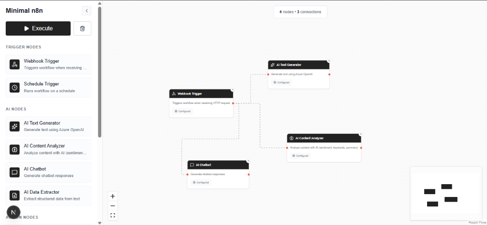

# Minimal n8n



A lightweight, high-performance, and AI-first workflow automation tool. Built with Next.js, ReactFlow, and Google Gemini, **Minimal n8n** allows you to build complex AI pipelines with zero complexity.

## ✨ Key Features

- **AI-First Chaining**: Seamlessly pass data between AI nodes (Chatbot, Text Generator, Analyzer, etc.) without manual variable mapping.
- **Smart Input Ingest**: Connect nodes in a line and watch data flow. If an input is left blank, the node automatically ingests the last output.
- **Modern Workflow Canvas**: A sleek, minimal UI inspired by n8n, optimized for clarity and speed.
- **Powerful Logic Nodes**: Includes If/Else branching based on JavaScript expressions and customizable Delays.
- **Integrated Actions**: Send emails, make HTTTP requests, and transform data using custom JavaScript.

## 🚀 Quick Start

### 1. Clone the repository
```bash
git clone https://github.com/ggoswami777/Minimal-n8n.git
cd Minimal-n8n
```

### 2. Install dependencies
```bash
npm install
```

### 3. Set up environment variables
Create a `.env.local` file in the root directory and add your Google Gemini API key:
```env
GEMINI_API_KEY=your_api_key_here
```

### 4. Run the development server
```bash
npm run dev
```
Open [http://localhost:3000](http://localhost:3000) with your browser to see the result.

## 🛠️ Technology Stack

- **Framework**: Next.js 14
- **Workflow UI**: ReactFlow
- **AI Core**: Google Gemini API (@google/generative-ai)
- **Styling**: Tailwind CSS
- **Icons**: Lucide React

## 💡 Showcase Workflow

1. **Trigger**: Add a **Webhook** or **Schedule** node.
2. **AI Logic**: Connect an **AI Chatbot** to generate ideas.
3. **Execution**: Connect an **AI Text Generator** (leave its prompt field blank to use the Chatbot's output).
4. **Analysis**: Chain an **AI Content Analyzer** to verify sentiment.
5. **Action**: Connect a **Send Email** node to automate the delivery.

## 📄 License

This project is licensed under the MIT License.
